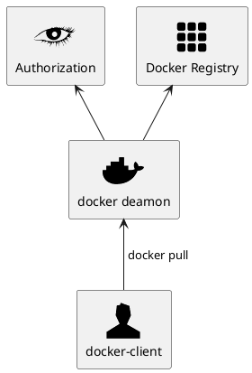

# authenticated-registry
An authenticated Docker Registry

You can find explanation there:
  - http://jgsqware.github.io/2016/02/docker-registry-installation/
  - https://weblog.wemanity.com/docker-registry-docker-hub-at-home-for-free/

# Quick Start

## Add new user
### Generate password for new User

Using htpasswd with BCrypt hash:

```
# htpasswd -nbB username password

$ htpasswd -nbB jgsqware jgsqware
jgsqware:$2y$05$oGKwJ8QJDLBOoTBmC/EQiefIMV1N9Yt9jpX3SqMoRqZRRql6q7yam
```

### Put new users to Auth Service config
- Edit *users* and *acl* sections in *config/auth_config.yml* file


# Docker Registry v2 authentication via a central service



1.  Attempt to begin a push/pull operation with the registry.
2.  If the registry requires authorization it will return a 401 Unauthorized HTTP response with information on how to authenticate.
3.  The registry client makes a request to the authorization service for a Bearer token.
4.  The authorization service returns an opaque Bearer token representing the client’s authorized access.
5.  The client retries the original request with the Bearer token embedded in the request’s Authorization header.
6.  The Registry authorizes the client by validating the Bearer token and the claim set embedded within it and begins the push/pull session as usual.


# Push docker container to Registry

## Authentication to Registry

```

docker login your_registry_uri

```

## Push image to registry
```

$ docker tag rhel-httpd registry-host:5000/myadmin/rhel-httpd

$ docker push registry-host:5000/myadmin/rhel-httpd

```

# Deploy a plain HTTP registry

# Generate Self Signed Certificate for Docker Auth

- We use *auth* as *Common Name* for the certificate
- We also use *auth* as the *URI* of my authentication server

```
openssl req -new -newkey rsa:4096 -days 365 -nodes -x509 \
    -subj "/C=VN/ST=Ho Chi Minh/L=Ho Chi Minh/O=MicZone/OU=Fado/CN=auth" \
    -keyout docker_auth.key  -out docker_auth.pem
```

# Generate Self Signed Certificate for Docker Registry

```
openssl req -new -newkey rsa:4096 -days 365 -nodes -x509 \
    -subj "/C=VN/ST=Ho Chi Minh/L=Ho Chi Minh/O=MicZone/OU=Fado/CN=registry.fado.vn" \
    -keyout docker_registry.key  -out docker_registry.pem
```

# References
- https://viblo.asia/p/trien-khai-private-docker-registry-tren-ubuntu-1804-voi-docker-traefik-tls-enabled-bWrZn0BY5xw